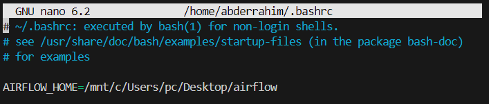
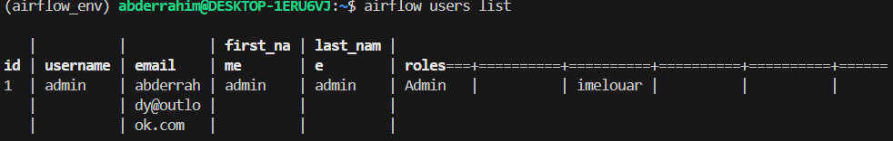
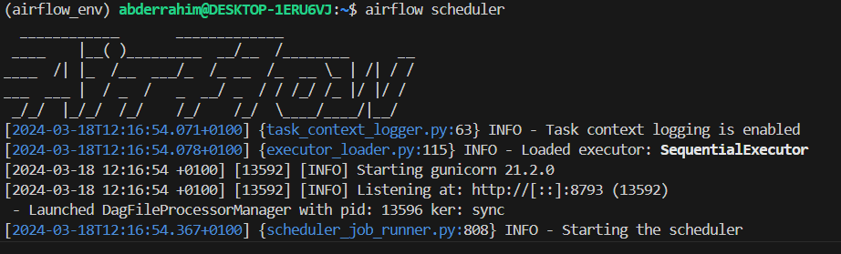
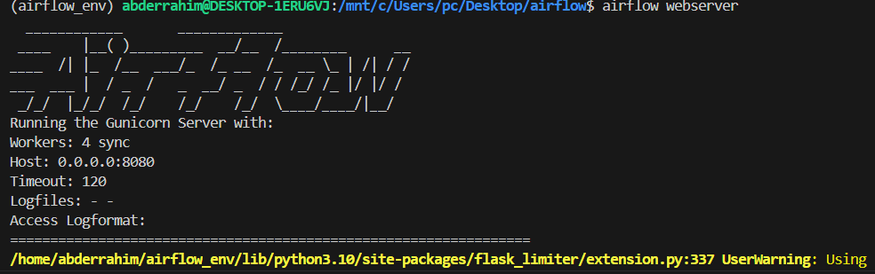
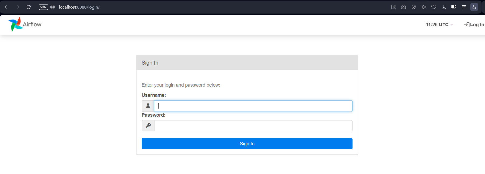

# Airflow Tutorial
## Installing Apache Airflow on Windows with WSL

Make sure that you have Python installed on your machine. Verify it using the `python --version` command.

Ensure that you have `pip`, the Python package manager, installed:
```
pip --version
```

### Activate Ubuntu or Other Linux System

If you haven’t already, make sure you’ve enabled Windows Subsystem for Linux (WSL) and installed a Linux distribution such as Ubuntu from the Microsoft Store. Launch the Linux terminal to proceed.

### Create a Virtual Environment and Activate It

Create a virtual environment using Python’s built-in venv module:
```
# Create virtual environment
python3 -m venv airflow_env

# Activate the virtual environment
source airflow_env/bin/activate
```

### Set the $AIRFLOW_HOME Parameter

Set the `$AIRFLOW_HOME` environment variable to specify where Airflow will store its configuration and metadata files. Add this line to your shell profile file (e.g., `.bashrc` or `.zshrc`):
```
export AIRFLOW_HOME=~/airflow
```



### Install Apache Airflow

```
pip install apache-airflow
```

### Initialize the Database

For storing metadata about your workflows:
```
airflow db init
```

### Create an Admin User

```
airflow users create \
    --username admin \
    --password admin \
    --firstname <YourFirstName> \
    --lastname <YourLastName> \
    --role Admin \
    --email admin@example.com
```

### Configure the DAGs Directory (optional)

In the Airflow configuration file (`airflow.cfg`), specify the location where your DAG files will reside. This allows you to organize your DAGs in a specific directory:
```
dags_folder = ~/airflow/dags
```

#### Check the created user:

```
airflow users list
```

### Run the Web Server and Scheduler

Run the scheduler with this command:
```
airflow scheduler
```



Launch another terminal, activate the Airflow virtual environment, `cd` to `$AIRFLOW_HOME`, and run the webserver:
```
airflow webserver
```

If the default port 8080 is in use, change the port by typing:
```
airflow webserver --port <port number>
```


#### Log in to the UI using the username created earlier

